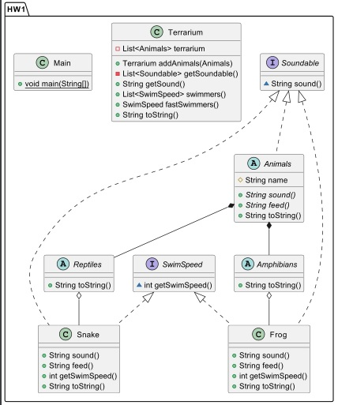

# Урок 1. Введение в понятие архитектуры, проектирование ПО и жизненный цикл программного продукта. UML-диаграммы


*Коллеги, обратите внимание! Если вы работаете на основе примера с семинара, прикрепите, пожалуйста, файл в формате .puml. Это позволит мне лучше оценить вашу работу и, возможно, добавить дополнительные примеры для визуализации. Также не забывайте читать комментарии после домашнего задания. В них содержатся примеры ручного добавления связей и отношений. И если возможно, отправляйте ссылку на ваш GitHub.
*

__

### Задание 1. На основе Диаграмы классов ModelElements, разработать классы: Model Store, PoligonalModel (Texture, Poligon), Flash, Camera, Scene
(Или Возьмите работу с ООП, Добавтье туда все возможное что мы смотрели на семинаре, и сделайте по ней UML диограмму)
### Задание 2. Ознакомиться с документацией в свободном формате, которая может пригодиться Вам для дальнейшей работы:
__
1. ГОСТ Р ИСО/МЭК 12207-2010 Информационная технология (ИТ). Системная и программная инженерия. Процессы жизненного цикла программных средств.
2. ISO/IEC/IEEE 29148:2018 Systems and software engineering — Life cycle processes — Requirements engineering
3. Стандарты ЕСКД — единая система конструкторской документации
4. ГОСТ 2.001-2013 ЕСКД. Общие положения
5. Стандарты АСУ ГОСТ 34 — автоматизированные системы управления
6. Стандарты ЕСПД ГОСТ 19 — единая система программной документации


## Домашняя работа 

Код написан на основе зоопарка. У нас есть несколько классов абстрактных как Рептилии и Амфибии. Они относятся к классу Животные как агрегация.
Класс Змея и Лягушка относиться к своим классам (Рептилии и Амфибии) как композиция. 




```
@startuml
abstract class HW1.Amphibians {
+ String toString()
}
abstract class HW1.Animals {
# String name
+ {abstract}String sound()
+ {abstract}String feed()
+ String toString()
}
abstract class HW1.Reptiles {
+ String toString()
}
class HW1.Frog {
+ String sound()
+ String feed()
+ int getSwimSpeed()
+ String toString()
}
class HW1.Snake {
+ String sound()
+ String feed()
+ int getSwimSpeed()
+ String toString()
}
interface HW1.Soundable {
~ String sound()
}
interface HW1.SwimSpeed {
~ int getSwimSpeed()
}
class HW1.Terrarium {
- List<Animals> terrarium
+ Terrarium addAnimals(Animals)
- List<Soundable> getSoundable()
+ String getSound()
+ List<SwimSpeed> swimmers()
+ SwimSpeed fastSwimmers()
+ String toString()
}
class HW1.Main {
+ {static} void main(String[])
}


HW1.Animals *-- HW1.Amphibians
HW1.Soundable <|.. HW1.Animals
HW1.Animals *-- HW1.Reptiles
HW1.SwimSpeed <|.. HW1.Frog
HW1.Soundable <|.. HW1.Frog
HW1.Amphibians o-- HW1.Frog
HW1.SwimSpeed <|.. HW1.Snake
HW1.Soundable <|.. HW1.Snake
HW1.Reptiles o-- HW1.Snake
@enduml
```

### Код на базе java 
```
package HW.HW1Animal;
import java.util.ArrayList;
import java.util.List;

abstract class Amphibians extends Animals {
    public Amphibians(String name) {
        super(name);
    }

    @Override
    public String toString() {
        return String.format("Amphibians: %s", super.toString());
    }
}
abstract class Animals implements Soundable {
    protected String name;

    public Animals(String name) {
        this.name = name;
    }

    public abstract String sound(); // метод голос животного
    public abstract String feed(); // метод чем питается животное

    @Override
    public String toString() {
        return String.format("Name: %s, Food: %s", name, feed());
        // То что будет выводиться
    }
}
abstract class Reptiles extends Animals {
    public Reptiles(String name) {
        super(name);
    }
    @Override
    public String toString() {
        return String.format("Reptiles: %s", super.toString());
    }
}
class Frog extends Amphibians implements SwimSpeed, Soundable {
    public Frog(String name) {
        super(name);
    }

    @Override
    public String sound() {
        return "ribbit";
    }

    @Override
    public String feed() {
        return "insects";
    }

    @Override
    public int getSwimSpeed() {
        return 10;
    }

    @Override
    public String toString() {
        return String.format("Frog: %s, Sound: %s, SwimSpeed: %d", super.toString(), sound(), getSwimSpeed());
    }
}
class Snake extends Reptiles implements SwimSpeed, Soundable {
    public Snake(String name) {
        super(name);
    }
    @Override
    public String sound() {
        return "Hiss";
    }
    @Override
    public String feed() {
        return "frogs, fish";
    }
    @Override
    public int getSwimSpeed() {
        return 20;
    }
    @Override
    public String toString() {
        return String.format("Snake: %s, Sound: %s, SwimSpeed: %d", super.toString(), sound(), getSwimSpeed());
    }
}
interface Soundable {
    String sound();
}
interface SwimSpeed {
    int getSwimSpeed();
}
class Terrarium {
    private List<Animals> terrarium = new ArrayList<>();

    public Terrarium addAnimals(Animals terraAmimals){
        terrarium.add(terraAmimals);
        return this;
    }

    private List<Soundable> getSoundable() {
//        List<Soundable> soundables = new ArrayList<>(terrarium);
//        return soundables;
        List<Soundable> soundables = new ArrayList<>();
        for (Animals animal : terrarium) {
            if (animal instanceof Soundable) {
                soundables.add((Soundable) animal);
            }
        }
        return soundables;
    }

    public String getSound() {
        StringBuilder builder = new StringBuilder();
        for (Soundable soundAnimal: getSoundable()) {
            builder.append(soundAnimal.sound()).append("\n");
        }
        return builder.toString();
    }

    public List<SwimSpeed> swimmers(){
        List<SwimSpeed> swimmersAnimals = new ArrayList<>();
        for (Animals animals : terrarium) {
            if (animals instanceof SwimSpeed){
                swimmersAnimals.add((SwimSpeed) animals);
            }
        }
        return swimmersAnimals;
    }
    public SwimSpeed fastSwimmers(){
        List<SwimSpeed> swimmers = swimmers();
        SwimSpeed fastSwim = swimmers.get(0);
        for (SwimSpeed animals : swimmers) {
            if (fastSwim.getSwimSpeed() < animals.getSwimSpeed()){
                fastSwim = animals;
            }
        }
        return fastSwim;
    }

    @Override
    public String toString() {
        StringBuilder builder = new StringBuilder("Обратите внимание кто живет в нашем террариуме!: \n");
        for (Animals animal: terrarium) {
            builder.append(animal).append("\n");
        }
        return builder.toString();
    }
}
public class Main {
    public static void main(String[] args) {
        Animals frog = new Frog("Петр");
        Animals snake = new Snake("Аркадий");
        Terrarium terrarium = new Terrarium();
        terrarium.addAnimals(frog).addAnimals(snake);
        System.out.println(terrarium);

        System.out.println("Что говорят животные?: ");
        System.out.println(terrarium.getSound());

        System.out.println("--- Самый быстрый участник заплыва ---");
        SwimSpeed fastSwim = terrarium.fastSwimmers();
        System.out.println(fastSwim);
        System.out.println("--- Участники турнира ---");
        for (SwimSpeed swimmers: terrarium.swimmers()) {
            System.out.println(swimmers);
        }
    }
}
```
