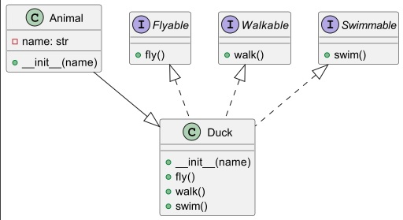
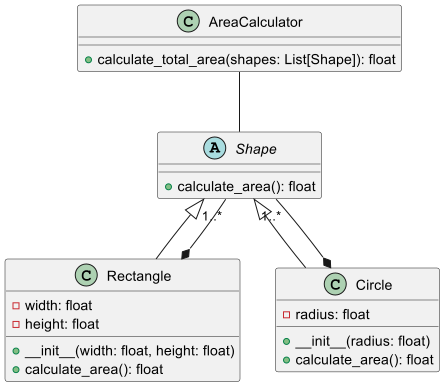
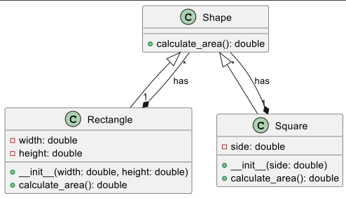
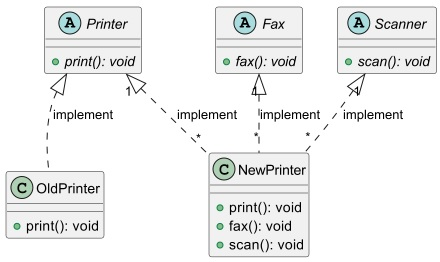
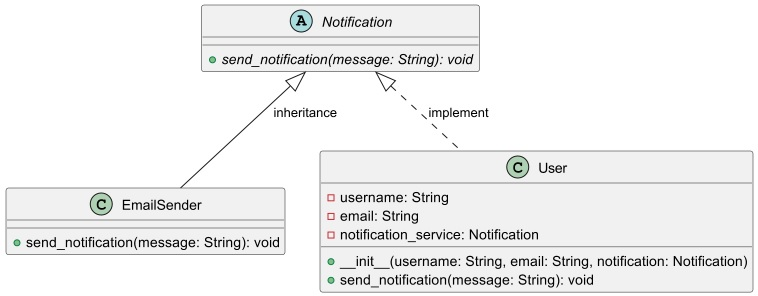

1. Принцип единственной ответственности (Single Responsibility Principle, SRP): Каждый класс должен иметь только одну причину для изменения. Это означает, что класс должен отвечать только за одно конкретное аспект своей функциональности. 

2. Принцип открытости/закрытости (Open/Closed Principle, OCP): Программные сущности должны быть открыты для расширения, но закрыты для модификации. Это достигается через использование полиморфизма, наследования и интерфейсов, чтобы добавлять новую функциональность, не изменяя существующий код.

3. Принцип подстановки Барбары Лисков (Liskov Substitution Principle, LSP): Объекты в программе могут быть заменены их наследниками. Это означает, что дочерний класс должен быть полностью совместим с родительским классом.

4. Принцип разделения интерфейсов (Interface Segregation Principle, ISP): Клиенты не должны зависеть от интерфейсов, которыми не пользуются. 

5. Принцип инверсии зависимостей (Dependency Inversion Principle, DIP): Модули верхнего уровня не должны зависеть от модулей нижнего уровня. Оба должны зависеть от абстракций. Это означает, что высокоуровневые компоненты должны зависеть от абстракций, а не от конкретных реализаций.
