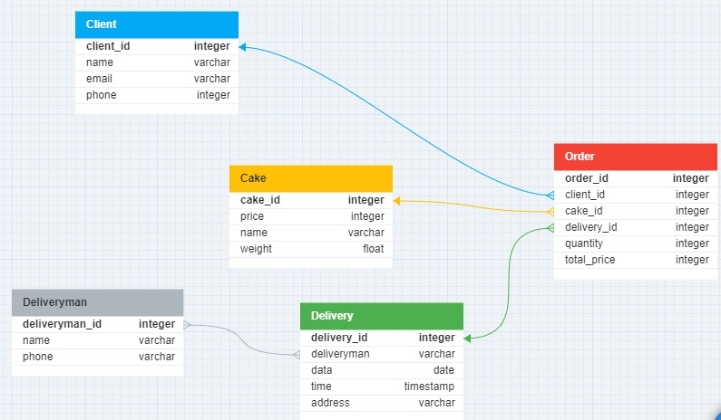

### ERD

### USE CASE 

#### Улучшения 

Описание связей
1. БД. БД собирает и хранит всю информацию. Например, после авторизации актеров(покупатель,продавец, администратор, поставщики) информация о них храниться в БД, т.е. происходит шифрованая передача логинов, паролей, номера телефонов и т.д. Так же в БД храняться заказы и все что с ними связано(номера заказов, их id, оплата и т.д.). БД хранит и историю закупок у поставщика(дата,время,партия и т.д.). В случае необходимости эту информацию можно извлечь и использовать. Например, из БД отправляется отчет по оплате в банк с информацией о зачислении/списании средств. Вся взаимосвязь с БД показано пунктиром. Напрямую с ней могут взаимодействовать продавцы,поддержка и администратор, но строго с определенным доступом к информации. Например, заказ попал в базу данных, но клиент хочет изменить этот заказ и дополнить этот заказа. Для этого продавец находит этот заказ в БД и может изменять его, либо обратить с администратору или в поддержку за болле глубоким доступом.

2. Возможности. Обычным стрелочками показаны элементы "влияния" актера на диаграмме. т.е. работая с заказами продавец имеет доступ к просмотру заказа, так же может использовать поиск по странице, фото галлерею и отзывам. Ограничивается только уровнем доступа. Более глубокий доступ имеет Администратор, который может вносить правки в галлерею, карточку товара, ответ на отзыв и т.д.

3. Взаимодействие. Все актеры, кроме покупателя, взаимодействвую между собой. У них есть общий блок: чаты, почты, переписки и т.д. Так же у администратора есть возможность работать с персаналом. Для него открыты возможности добавления в чаты/группы, предоставление доступа к ресурсам и многое другое.

4. Графическое сопровождение 

